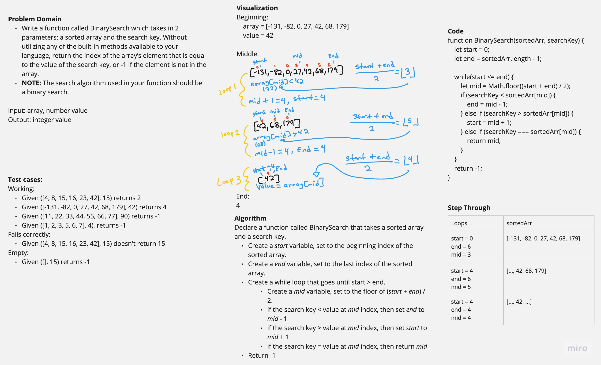

# Array Binary Search

Write a function called BinarySearch which takes in 2 parameters: a sorted array and the search key. Without utilizing any of the built-in methods available to your language, return the index of the array’s element that is equal to the value of the search key, or -1 if the element is not in the array.
NOTE: The search algorithm used in your function should be a binary search.

## Whiteboard Process



## Approach & Efficiency

Binary search algorithm with a while loop and variables to narrow down the index of search key in the given sorted array. Time complexity is O(log n).

## Solution

Paste code into editor with console.

Needs a sorted array and a number value as parameters.

Log the result.

```javascript
function BinarySearch(sortedArr, searchKey) {
  let start = 0;
  let end = sortedArr.length - 1;
  while (start <= end) {
    let mid = Math.floor((start + end) / 2);
    if (searchKey < sortedArr[mid]) {
      end = mid - 1;
    } else if (searchKey > sortedArr[mid]) {
      start = mid + 1;
    } else {
      return mid;
    }
  }
  return -1;
}
```
