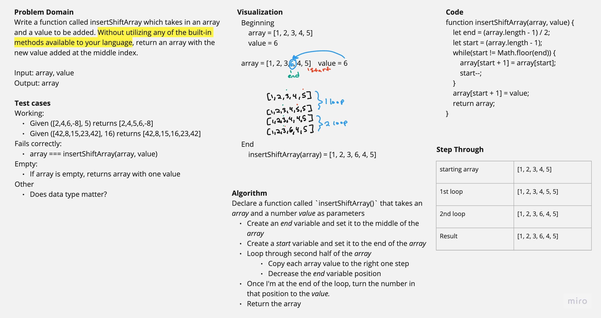

# Insert Shift Array

Write a function called insertShiftArray which takes in an array and a value to be added. Without utilizing any of the built-in methods available to your language, return an array with the new value added at the middle index.

## Whiteboard Process

## Approach & Efficiency

I thought about making a new array and putting values into it, but I wanted to try and find a solution where I didn't have to make a new array, so I looped through the given array starting from the back and stopping halfway and just shifted the values over and inserted the given value in the middle. That seemed more efficient then making a new array. I haven't learned Big O yet.

## Solution

My code can be run by copying the code into a code editor with a console. It will also need an array and a value (of any kind) to take in as a parameter and then a line of code consoling the result from the function.
