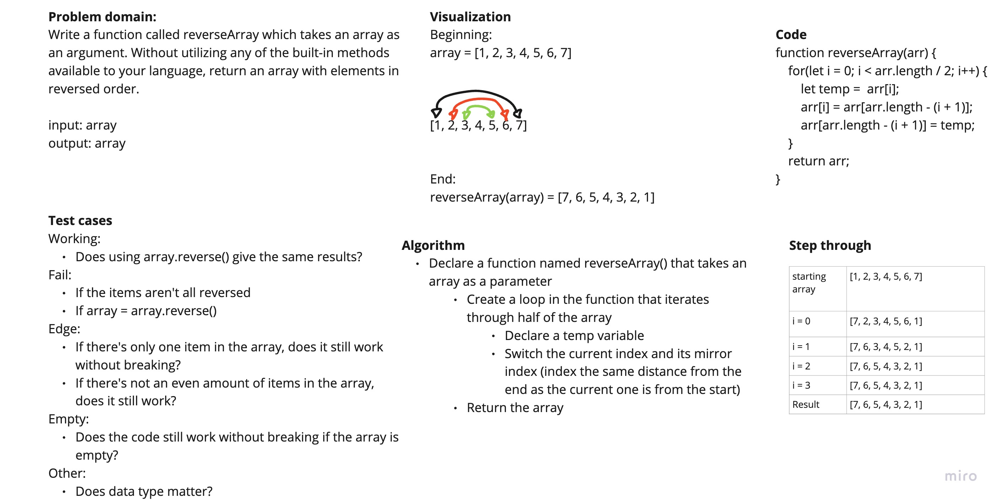

# Reverse an Array

Write a function called reverseArray which takes an array as an argument. Without utilizing any of the built-in methods available to your language, return an array with elements in reversed order.

## Whiteboard Process



## Approach & Efficiency

A for loop and a temp variable. Solution does not require creating a new array.

## Solution

Paste code into editor with console.

Needs an array as a parameter.

Log the result.

```javascript
function reverseArray(arr) {
  for (let i = 0; i < arr.length / 2; i++) {
    let temp = arr[i];
    arr[i] = arr[arr.length - (i + 1)];
    arr[arr.length - (i + 1)] = temp;
  }
  return arr;
}
```
