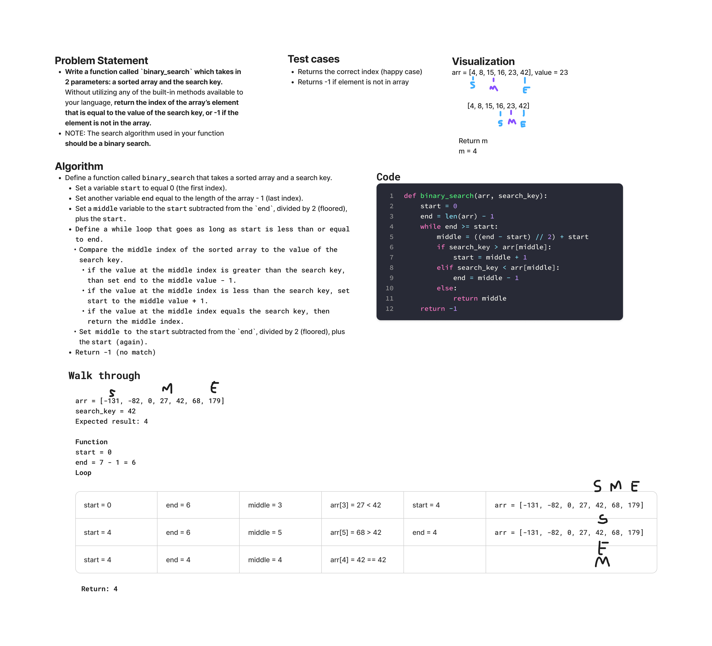

# Array Binary Search

Write a function called `binary_search` which takes in 2 parameters: a sorted ~~array~~ list and the search key. Without utilizing any of the built-in methods available to your language (except `len()`), return the index of the ~~array~~ list’s element that is equal to the value of the search key, or -1 if the element is not in the ~~array~~ list.

NOTE: The search algorithm used in your function should be a binary search.

## Whiteboard process



## Approach & Efficiency

- Used binary search algorithm
- Set pointers, `start` = 0, `end` = `len(arr) - 1`
- Run loop `while end >= start`
- Adjust the pointers depending on whether the `middle` value is less than or greater than the search key
- Return the `middle` index if the middle value is equal to the search key
- Return -1 if the search key is never found during loop
- Time complexity is O(log n). Space complexity is O(1)

## Solution

Call `binary_search` with a sorted list of number values, and a search key.

```python
def binary_search(arr, search_key):
  start = 0
  end = len(arr) - 1
  while end >= start:
    middle = ((end - start) // 2) + start
    if search_key > arr[middle]:
        start = middle + 1
    elif search_key < arr[middle]:
        end = middle - 1
    else:
        return middle
  return -1
```
