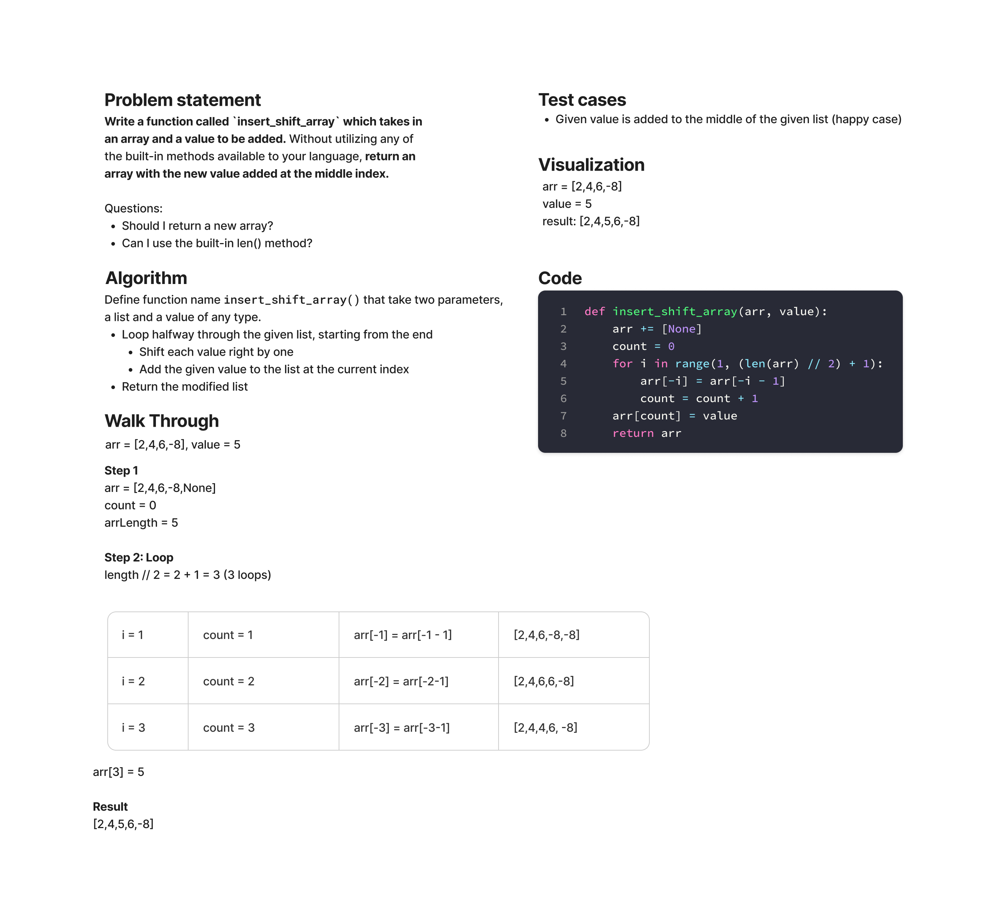

# Array Insert Shift

Write a function called `insert_shift_list` which takes in ~~an array~~ a list and a value to be added. Without utilizing any of the built-in methods available to your language, return ~~an array~~ a list with the new value added at the middle index.

## Whiteboard process



## Approach & Efficiency

- Loop halfway through the given list
- Shift all the array items one to the right starting from the end of the list
- Add the given value to the list once the loop stops
- The time complexity is O(n) and the list is modified in place for efficiency

## Solution

Call `insert_shift_list` with a list with values of any type, and a value.

```python
def insert_shift_list(arr, value):
  arr += [None]
  count = 0
  for i in range(1, (len(arr) // 2) + 1):
      arr[-i] = arr[-i - 1]
      count = count + 1
  arr[count] = value
  return arr
```
