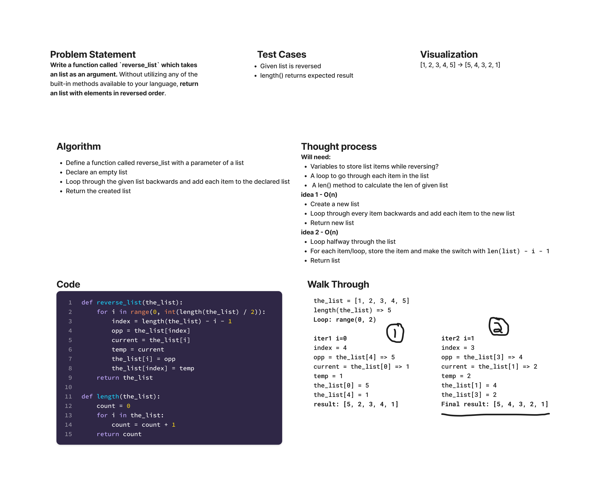

# Array Reverse

Write a function called ~~reverseArray~~ reverse_list which takes an ~~array~~ list as an argument. Without utilizing any of the built-in methods available to your language, return ~~an array~~ a list with elements in reversed order.

## Whiteboard process



## Approach & Efficiency

Looped halfway through the length of the given list and switch each index with its negative index.
Did not use any built-in methods.
The time complexity is O(n)

## Solution

Call `reverse_list` below with a list of values.

```python
def reverse_list(the_list):
    for i in range(0, int(length(the_list) / 2)):
        index = length(the_list) - i - 1
        opp = the_list[index]
        current = the_list[i]
        temp = current
        the_list[i] = opp
        the_list[index] = temp
    return the_list

def length(the_list):
    count = 0
    for i in the_list:
        count = count + 1
    return count
```
